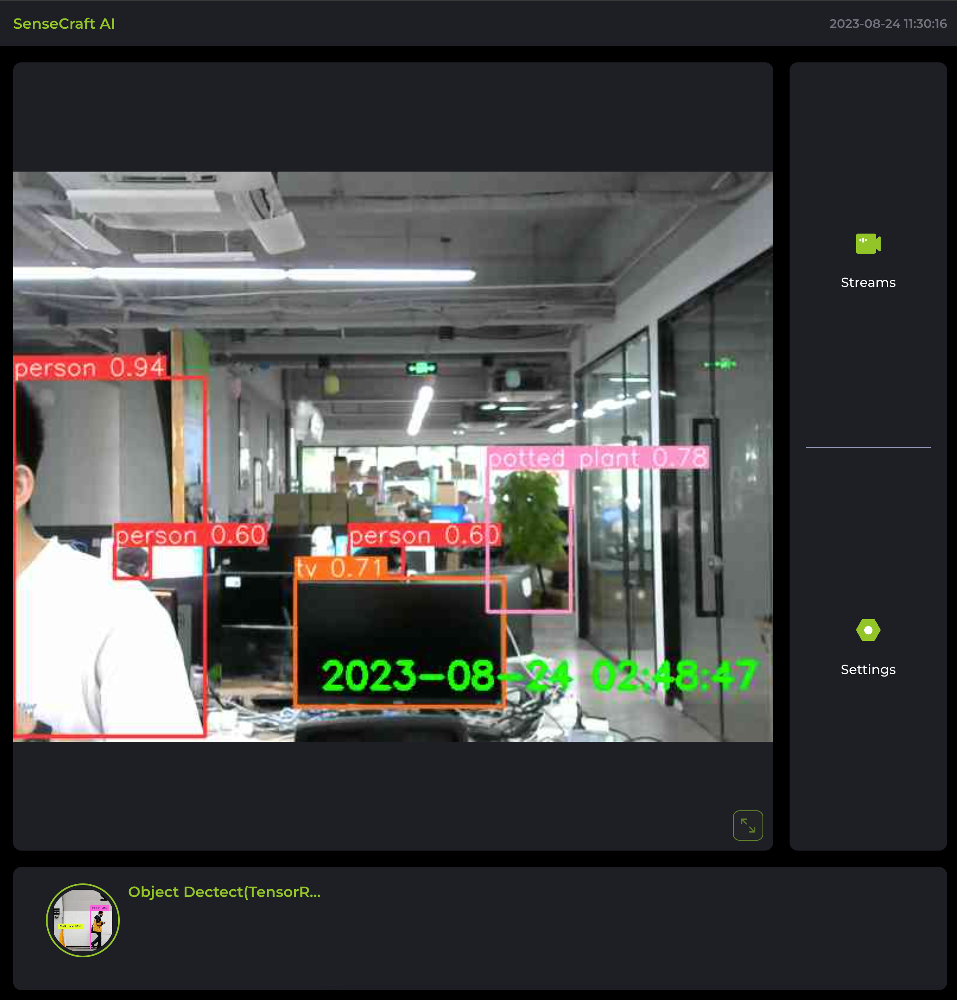
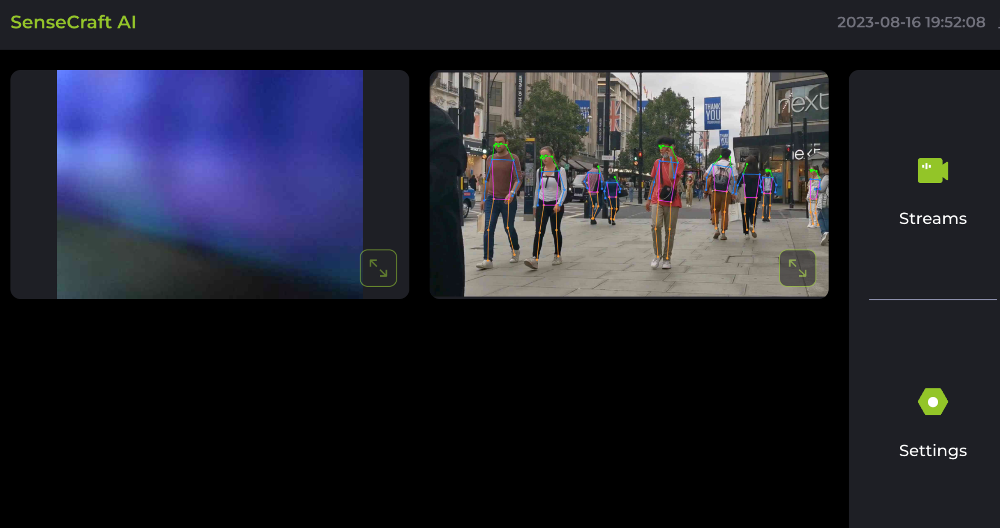
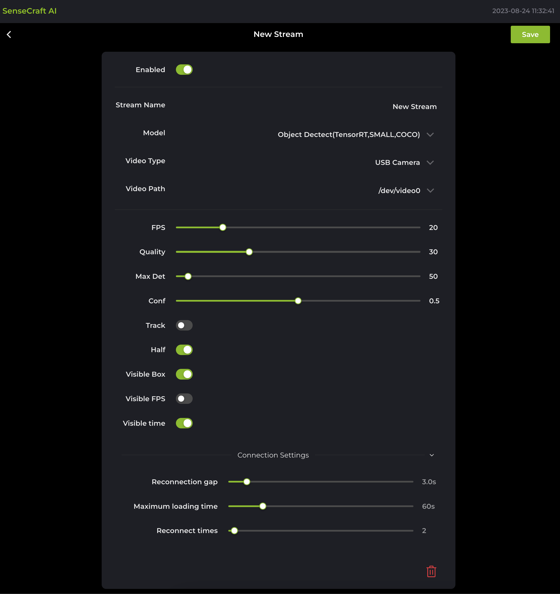
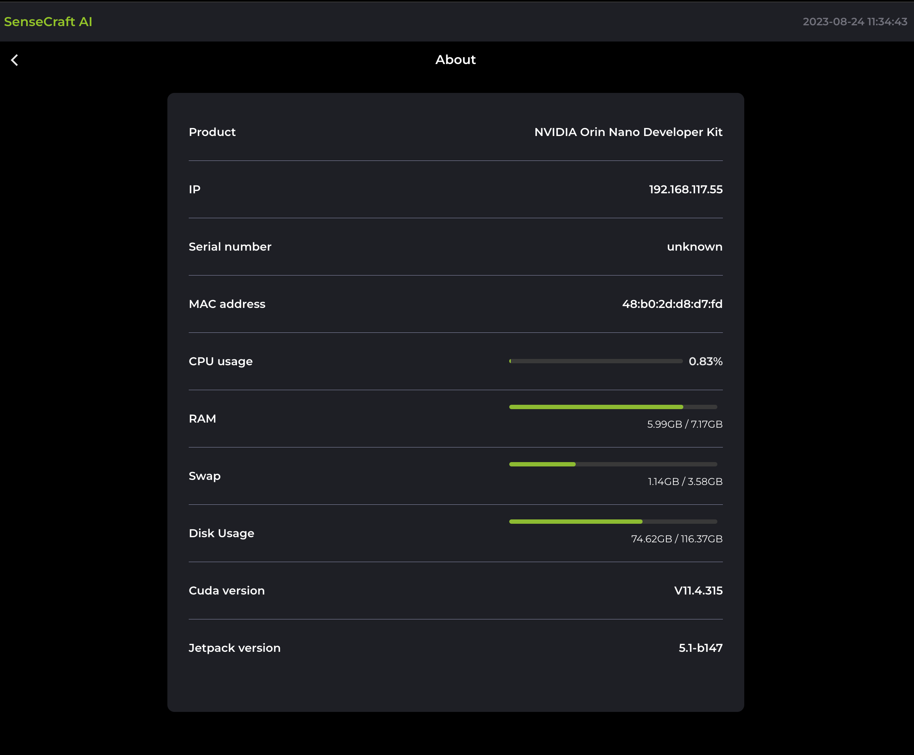

# Sensecraft AI frontend

This is **Sensecraft AI frontend project** . It works in conjunction with **Sensecraft AI**. It is also open-source and can be found at [Sensecraft AI Repository ↗](). It provides the necessary API endpoints and handles the business logic for the frontend application.


## Getting Started
### Environment & Dependencies

- **Nodejs 16+**
- **Vite**
- **Typescirpt**
- **Vue3 + Pinia**
- **UI Component Library**: [TDesign Web Vue UI](https://tdesign.tencent.com/vue/overview)

### Install Dependencies
```pnpm install```

### Development Mode
`pnpm run dev`

Open your browser and visit: [http://localhost:1430](http://localhost:1430)

### Build for Production
`pnpm run build`

## Project Structure

The project follows a standard structure to organize its files and folders:

```
├── index.html
├── frame.html
├── src
│   ├── App.vue
│   ├── api
│   ├── assets
│   ├── components
│   ├── i18n
│   ├── layout
│   ├── main.ts
│   ├── router
│   ├── store
│   ├── types
│   ├── utils
│   ├── view
│   └── vite-env.d.ts
├── public
│   ├── icon_aimodel.svg
│   └── vite.svg
├── README.md
├── auto-imports.d.ts
├── components.d.ts
├── tailwind.config.js
├── tsconfig.json
├── tsconfig.node.json
├── package.json
├── pnpm-lock.yaml
├── postcss.config.js
└── vite.config.ts
```

The `public` directory contains the static assets and the main `index.html` file. The `src` directory is where the application's source code resides. It includes folders for assets, reusable components, views, store (Pinia store modules), and the main application entry point (`App.vue` and `main.js`).

## Environment Configuration

To configure your environment variables, create a `.env` file in the project root directory and define your variables there. Here's an example of the required variables:

```
VITE_API_PATH=your-api-url
```

Make sure to replace `your-api-url` with the appropriate values for your project.


## Demo Screenshots

Here are some screenshots showcasing the project's user interface:

- **Main page**

  

- **Streams list**

  

- **Stream Config**

  

- **Settings**

  

- **About**

  


Please ensure that your code adheres to the project's coding conventions and includes appropriate documentation.

## License

This project is licensed under the [MIT License](LICENSE).
